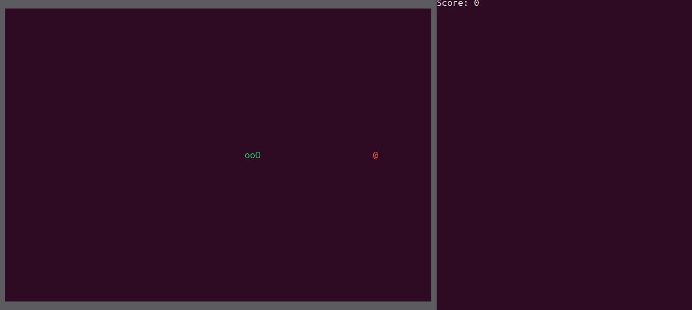

# Snake (Rust)

A simple terminal Snake game written in Rust using `crossterm`.



## Requirements
- Rust toolchain (stable)

## Run
```bash
cargo run
```

## Controls
| **Key** | **Action** |
| :-----: | :-------- |
| `W`/ `↑` | Move Up |
| `A`/`←`| Move Left |
| `S`/`↓` | Move Down |
| `D`/`→`| Move Right |
| `Q`/`Esc` | Quit |
